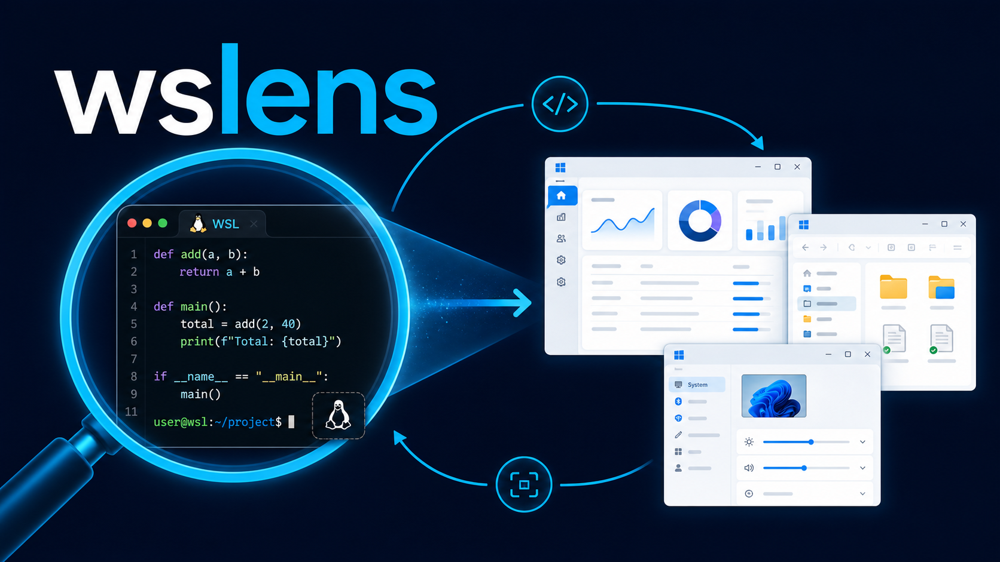

# wslens



`wslens` lets scripts list, capture, move, resize, focus, close, click, drag, and type into Windows top-level windows. It runs from WSL or directly on Windows.

It is useful when a tool runs inside WSL but the application under test opens in Windows user space. For example, a coding agent can launch a Windows app, inspect its windows, take screenshots, resize it into a known shape, focus it, and close it again from the WSL side.

That closes the feedback loop for agentic development: the harness can see the result of what it changed instead of relying only on logs, build output, or the user describing the UI.

`wslens` is a PowerShell backend that calls Windows APIs through `user32.dll`, plus thin entry points for WSL (Bash wrapper) and pure Windows (`.cmd` shim). It also works on plain Windows without WSL.

## Requirements

- Windows with `powershell.exe`
- For the WSL wrapper: WSL, `powershell.exe` in the WSL `PATH`, `wslpath`, `realpath`

## Install

### WSL

```bash
./install.sh
```

This installs:

- `~/.local/bin/wslens`
- `~/.local/share/wslens/wslens.ps1`

Make sure `~/.local/bin` is in your `PATH`.

### Pure Windows (no WSL)

From PowerShell in the repo directory:

```powershell
.\install.ps1
```

This installs `wslens.cmd` and `wslens.ps1` into `%LOCALAPPDATA%\wslens` (override with `$env:WSLENS_INSTALL_DIR`) and prints PATH advice if the directory is not already in `PATH`. After that, `wslens` works from both cmd and PowerShell:

```powershell
wslens list
wslens capture title:Notepad -o shot.png
```

Relative `-o` paths resolve against the current directory; absolute Windows paths work as-is.

## Usage

```text
wslens list [--all] [--json] [--title REGEX] [--process REGEX]
wslens bounds <target> [--json]
wslens capture <target> [-o PATH] [--restore] [--json]
wslens screen [-o PATH] [--json]
wslens record start <target|screen> [-o PATH] [--fps N] [--json]
wslens record stop [--json]
wslens lease acquire <target> [--ttl SECONDS] [--json]
wslens lease release <token> [--json]
wslens resize <target> <width> <height> [--x X] [--y Y] [--restore] [--activate] [--json]
wslens move <target> <x> <y> [--restore] [--activate] [--json]
wslens focus <target> [--lease TOKEN] [--json]
wslens click <target> <x> <y> [--relative] [--restore] [--activate] [--lease TOKEN] [--json]
wslens drag <target> <x1> <y1> <x2> <y2> [--relative] [--restore] [--activate] [--lease TOKEN] [--json]
wslens key <target> <sendkeys> [--restore] [--activate] [--lease TOKEN] [--json]
wslens type <target> <text> [--restore] [--activate] [--lease TOKEN] [--json]
wslens close <target> [--json]
wslens launch <command-or-uri> [args...] [--json]
wslens active [--json]
wslens monitors [--json]
wslens screensaver [--json]
wslens wake [--json]
```

With `--json`, all output keys are snake_case (e.g. `hwnd`, `pid`, `work_width`, `screensaver_running`).

Targets:

```text
idx:N             window index from `wslens list`
N                 same as idx:N if N matches a listed index
0xHWND            window handle, e.g. 0x8032E
hwnd:0xHWND       explicit window handle
title:REGEX       first listed window whose title matches REGEX
process:REGEX     first listed window whose process matches REGEX
```

Examples:

```bash
wslens list
wslens capture idx:16 -o shot.png
wslens screen -o desktop.png
wslens record start title:Chrome -o demo.mkv --json
wslens record stop --json
token=$(wslens lease acquire title:Chrome --json | jq -r .token)
wslens key title:Chrome '^l' --activate --lease "$token"
wslens lease release "$token" --json
wslens resize 16 1200 800
wslens resize 0x8032E 1200 800 --x 100 --y 80
wslens move title:Spotify 50 50
wslens click title:Calculator 42 180 --relative --activate
wslens key title:Chrome '^l' --activate
wslens type title:Notepad 'hello from WSL' --activate
wslens close title:Spotify
wslens launch notepad.exe
wslens launch https://example.com
wslens active --json
wslens monitors
wslens screensaver
wslens wake
```

## Agent development workflow

A typical loop from WSL looks like this:

```bash
# Start or rebuild the app from WSL, even if it opens a Windows window.
npm run dev

# Find the window the app opened.
wslens list --process "chrome|msedge|electron"

# Put it in a predictable position and size before inspecting it.
wslens resize title:MyApp 1400 900 --x 80 --y 80 --activate

# Capture the current UI into the WSL working directory.
wslens capture title:MyApp -o artifacts/myapp.png

# Record the window while driving it; defaults to recording.mkv and needs ffmpeg.
wslens record start title:MyApp -o artifacts/myapp.mkv --json
# Drive simple UI flows when visual inspection alone is not enough.
wslens click title:MyApp 240 180 --relative --activate
wslens type title:MyApp 'hello from WSL' --activate

wslens record stop --json
# Close it when the run is done.
wslens close title:MyApp
```

This is especially handy for coding harnesses and other automation running inside WSL. The agent can make a code change, run the app, capture the Windows UI, inspect the screenshot, and iterate without needing manual screenshots or copy-pasted descriptions.
